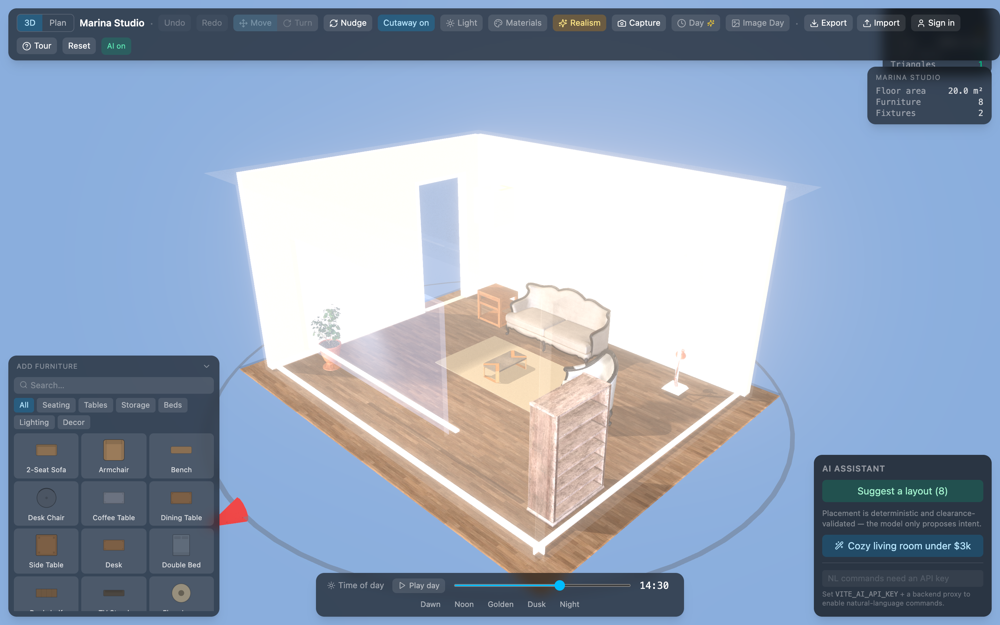
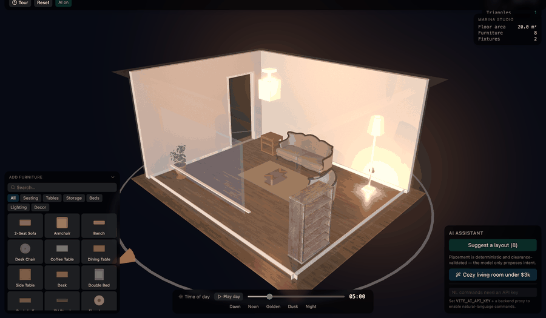
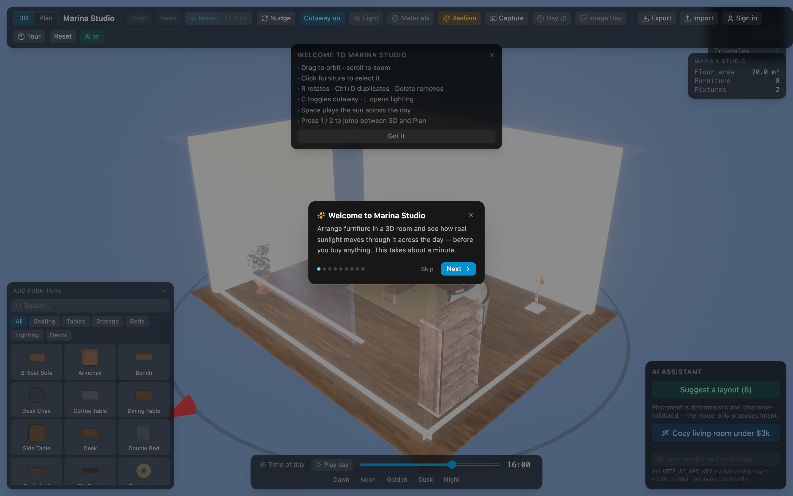
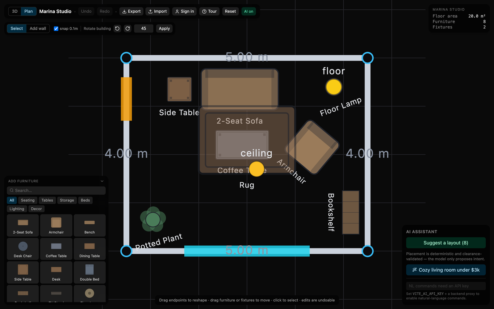
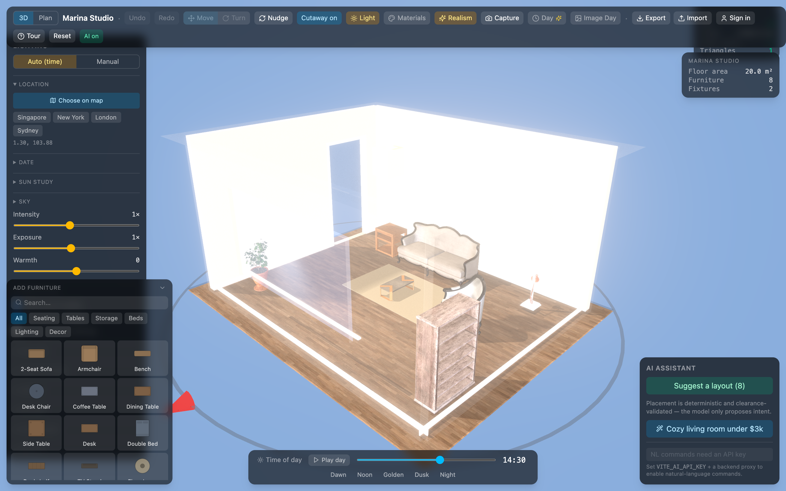
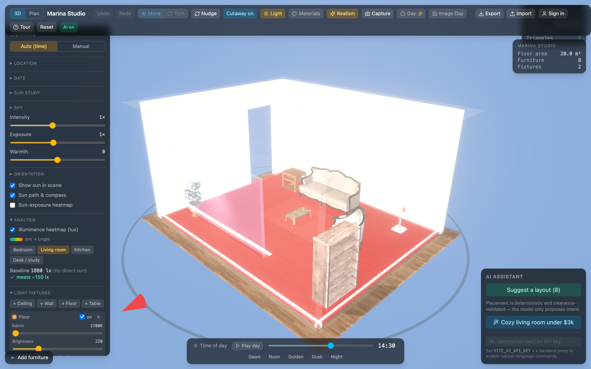
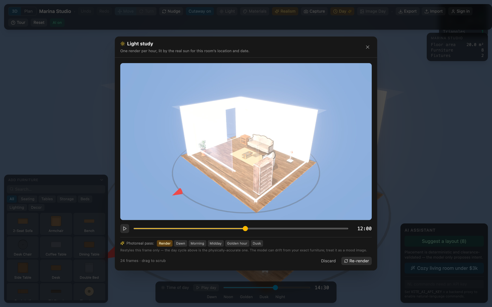
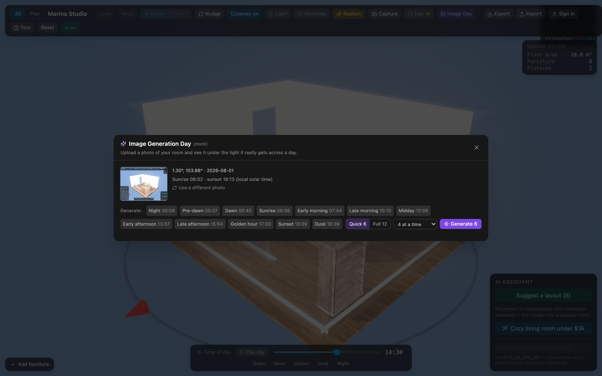
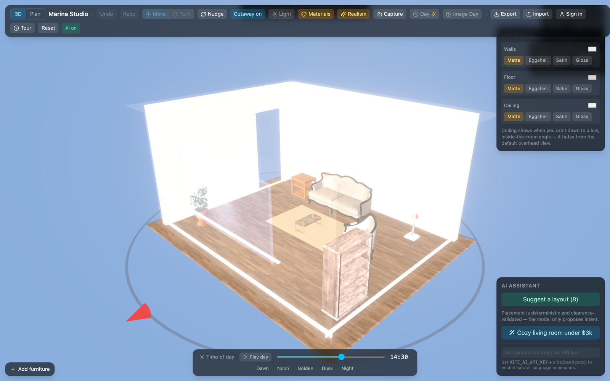

<div align="center">

# Project Lumos

### See the light before you buy the sofa.

Arrange furniture in a 3D model of a real room and watch **actual sunlight** move through it
across the day — from your building's coordinates, orientation and date.

[](LICENSE)
[](https://nodejs.org)
[](https://react.dev)
[](https://threejs.org)

[**Quick start**](#-quick-start) · [**Deploy**](#-deploy-it) · [**Architecture**](#-architecture)



</div>

---

## The idea

Put your building on a satellite map, turn the room to face the way it really does, and the sun
in the scene becomes the one that will be over that address that day. Move the slider and the
light follows — through the real windows, at the real angles.

A room with no windows and no lamps renders **dark**, because it would be.

<div align="center">

<br>
<em>One room, 05:30 → 20:30 — every frame at the true sun position.</em>
</div>

---

## 🚀 Quick start

[Node.js](https://nodejs.org) 22+. No keys, no database, no account.

```bash
corepack enable
git clone https://github.com/tjandera/lumos.git && cd lumos
pnpm install && pnpm dev
```

Open **http://localhost:5173**; the API runs on `:8787`. Or `docker compose up --build` for web
on `:8080` with Postgres.

**The AI features run free with no key** — copy `apps/api/.env.example` to `apps/api/.env` and
set `LIGHT_STUDY_MOCK`, `IMAGE_DAY_MOCK` and `ROOM_PHOTO_MOCK` to `true`. Add a real
`OPENAI_API_KEY` for real results.

---

## ✨ What you can do

**Start guided.** A nine-step walkthrough over a sample room, replayable any time.



**Draw the room.** A 2D plan editor — real wall thickness, windows and doors, extruded to 3D
with genuine openings. Every edit is one undo step.



**Put it somewhere real.** Find your building on satellite imagery and orient the room. Only a
[coarsened](#-privacy) coordinate leaves your machine.



**Light it honestly.** Sun position from `suncalc` for your location, date and orientation.
Fixtures carry physical units; a lux heatmap checks the room against standards.



**Study the whole day.** One render per hour, scrubbable — including after sunset, when lamps
take over.



**Study your *own* room from a photo.** *Image Generation Day* shows a photographed room under
the daylight it actually gets, across twelve moments spanning 24 hours. Generate one, six, or all
twelve in parallel, then download them as a ZIP with times and sun angles.



**Furnish and share.** 35 CC0 glTF models at verified real dimensions, collision-aware placement,
10 PBR texture families — then share read-only via an unguessable link.



---

## 🌍 Deploy it

`docker compose up --build` for a single host, or `kubectl apply -k deploy/k8s/overlays/local`
for Kubernetes — probes, resource limits, HPAs, non-root read-only containers, single-origin
ingress ([details](deploy/README.md)).

**Free hosting:** **Cloudflare Pages** + **Cloud Run** + **Neon** — picked because image
generation takes 35–90 s per call, which most free serverless tiers time out on.

### ⚠️ Before you point a public URL at this

| Set this | To | Or else |
| --- | --- | --- |
| `SESSION_SECRET` | `openssl rand -base64 48` | Publicly-known default; anyone can forge design ownership. |
| `NODE_ENV` | `production` | No secure cookies or HSTS; localhost stays in the CORS allowlist. |
| `TRUST_PROXY` | your hop count (`1` behind one proxy) | Per-IP rate limits collapse into one global bucket. |
| `VITE_ORIGIN` | your public web URL | CORS rejects your own front end. |
| `IMAGE_DAILY_MAX` | a number you'll happily pay | **Image endpoints are unauthenticated by design** — a public URL is a free image generator on your key. |

Set a monthly spend limit in the OpenAI dashboard too — the only layer that survives a bug in
the others. Full audit: [`deploy/SECURITY.md`](deploy/SECURITY.md).

**The most common broken deployment** is `VITE_API_URL`: Vite bakes it in at *build* time, so a
runtime variable does nothing. Use `--build-arg VITE_API_URL=/api`.

---

## 🏗 Architecture

**The scene document is the contract.** `packages/core` owns a plain, serializable
`SceneDocument` — zod schema, versioned with migrations, meters, Y-up. The renderer draws it, the
AI proposes edits, the API stores it. Nothing else is shared state, so each can change without
the others noticing.

```
            ┌──────────────────┐
            │  packages/core   │  pure TS · zod · migrations
            │  SceneDocument   │  sun · daylight · lux
            └────────┬─────────┘
      ┌──────────────┼──────────────┐
 ┌────▼─────┐   ┌────▼─────┐   ┌────▼─────┐
 │ renderer │   │    ai    │   │   api    │
 └────┬─────┘   └────┬─────┘   └────┬─────┘
      └──────────────┼──────────────┘
                ┌────▼─────┐
                │   web    │  React 19 · R3F v9
                └──────────┘
```

Three invariants carry the design:

1. **Every schema change bumps `CURRENT_SCHEMA_VERSION` and ships a migrator**, so saved designs
   never break.
2. **The AI never emits coordinates.** It proposes constraints; a deterministic solver places and
   validates. LLM spatial reasoning is unreliable, so it stays out of that loop.
3. **Undo is patch-based** — one logical edit, including a multi-step AI edit, is one step.

Each package has a README; conventions in [`CLAUDE.md`](CLAUDE.md).

```bash
pnpm dev   # web + api        pnpm test   pnpm typecheck   pnpm lint
```

---

## 🔒 Privacy

A home address is PII and never enters the scene document. Only coarse coordinates travel with a
design — lat/lng rounded to ~1 km plus a north offset: enough for the sun to be right, not enough
to identify a building. **Coarsening happens server-side**, so it cannot be bypassed.

## 🧪 Testing

`core` 133 · `renderer` 55 · `ai` 50 · `api` 230 pass. `apps/web`: 320 pass, **25 fail**.

**Known gap:** those failures come from an in-progress module port (`guidance/*`, `store/*`,
`ai/chatStore`, `furniturePlacement`, `DaylightSummary`), so **`pnpm test` exits non-zero** and CI
is red until it lands.

## 📄 License

[MIT](LICENSE). Third-party models and textures are CC0 — provenance in
[`LICENSES.md`](LICENSES.md).
